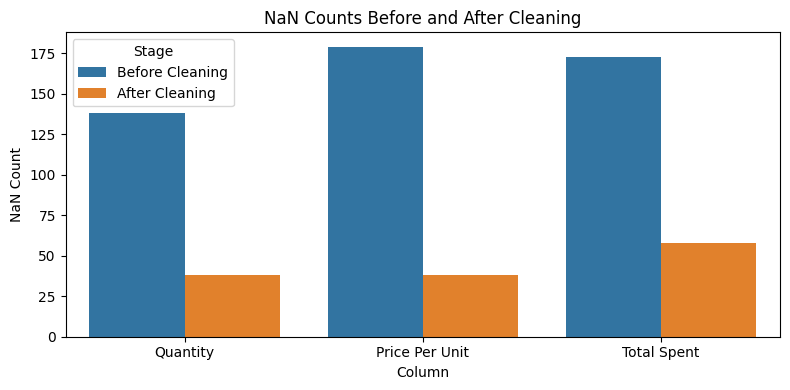

# Cafe Sales Data Cleaning

This project demonstrates how to clean, validate, and visualize transaction data from a cafe sales dataset. It addresses common data quality issues such as missing values, inconsistent formats, invalid entries, and outliers. The workflow includes both code and visualizations to help you understand the impact of each cleaning step.

---

## Project Overview

- **Data Cleaning:** Handle missing values, fix data types, standardize categorical values, and correct inconsistencies.
- **Data Validation:** Compare raw and cleaned data to ensure integrity, consistency, and readiness for analysis.
- **Visualization:** Use charts to illustrate the effects of cleaning and validation.

---

## Example Visualizations

### 1. Missing Values Before and After Cleaning

```python
import seaborn as sns
import matplotlib.pyplot as plt
import pandas as pd

# Example: Replace with your actual data loading
raw_df = pd.read_csv("data/dirty_cafe_sales.csv")
clean_df = pd.read_csv("notebooks/cleaned_cafe_sales.csv")

nan_counts_before = [raw_df['Quantity'].isna().sum(), raw_df['Price Per Unit'].isna().sum(), raw_df['Total Spent'].isna().sum()]
nan_counts_after = [clean_df['Quantity'].isna().sum(), clean_df['Price Per Unit'].isna().sum(), clean_df['Total Spent'].isna().sum()]

nan_compare_df = pd.DataFrame({
    'Column': ['Quantity', 'Price Per Unit', 'Total Spent'],
    'Before Cleaning': nan_counts_before,
    'After Cleaning': nan_counts_after
})

nan_compare_df_melted = nan_compare_df.melt(id_vars='Column', var_name='Stage', value_name='NaN Count')

plt.figure(figsize=(8,4))
sns.barplot(data=nan_compare_df_melted, x='Column', y='NaN Count', hue='Stage')
plt.title('NaN Counts Before and After Cleaning')
plt.tight_layout()
plt.show()
```




## How to Use

1. **Clone this repository.**
2. **Place your raw data in the `data/` folder.**
3. **Run the Jupyter notebooks in the `notebooks/` folder step by step.**
4. **Review the visualizations and outputs to understand the cleaning process.**

---

## Requirements

- Python 3.8+
- pandas
- numpy
- matplotlib
- seaborn
- jupyter

Install requirements with:

```bash
pip install -r requirements.txt
```

## License
MIT License

