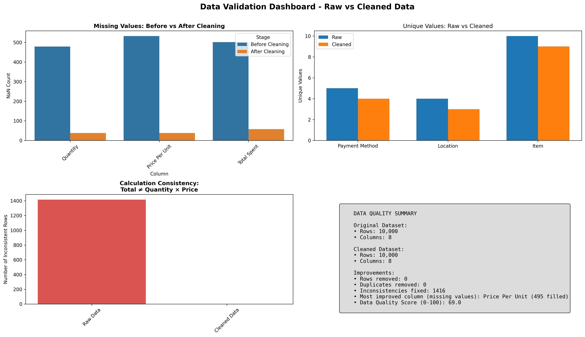
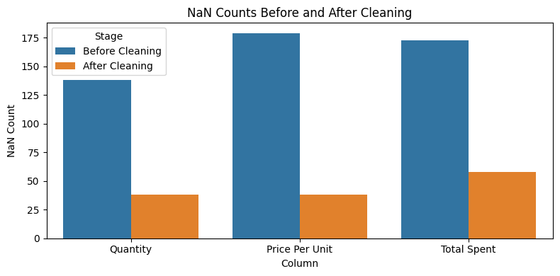
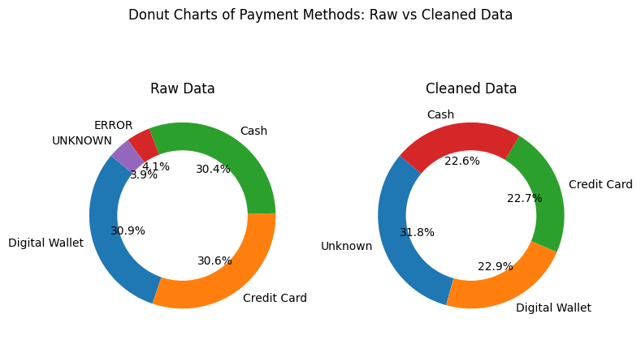

# Cafe Sales Data Cleaning

This project demonstrates how to clean, validate, and visualize transaction data from a cafe sales dataset. It addresses common data quality issues such as missing values, inconsistent formats, invalid entries, and outliers. The workflow includes both code and visualizations to help understand the impact of each cleaning step.

---
## Project Overview

- **Data Exploration:** Examine the raw dataset to identify data quality issues, patterns, and potential outliers.
- **Data Cleaning:** Handle missing values, fix data types, standardize categorical values, and correct inconsistencies.
- **Data Validation:** Compare raw and cleaned data to ensure integrity, consistency, and readiness for analysis.
- **Implementation:** The workflow is available as both Python scripts and Jupyter notebooks, allowing you to choose your preferred environment for running and reviewing the cleaning steps.
---

## Example Visualizations


### Validation Dashboard Example



###  Missing Values Before and After Cleaning



###  Donut Charts of Payment Methods: Raw vs Cleaned Data




## How to Use

1. **Clone this repository.**
2. **Place your raw data in the `data/` folder.**
3. **Run the Jupyter notebooks in the `notebooks/` folder step by step, or execute the provided Python scripts.**
4. **Review the visualizations and outputs to understand the cleaning process.**

---

## Requirements

- Python 3.8+
- pandas
- numpy
- matplotlib
- seaborn
- jupyter

Install requirements with:

```bash
pip install -r requirements.txt
```

## License
MIT License

